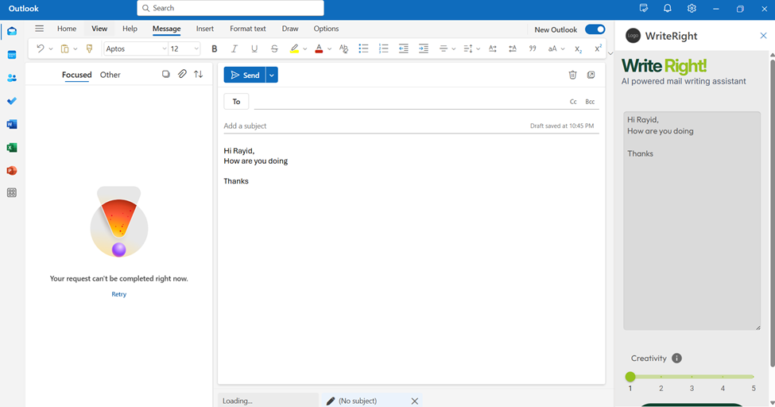

# ✉️ Write Right – AI-Powered Outlook Plugin

**Write Right** enhances your Outlook email writing experience by allowing users to tune creativity levels. From basic proofreading to full rewriting, this AI-powered plugin helps you craft clear, impactful, and professional messages with ease.

---

## 🖼️ Plugin Preview



*Above: Screenshot of the plugin in the Outlook compose window.*

---

## 🚀 Creativity Tuning Features

- 🔍 **Proof Reader**: Fixes grammar, typos, and spelling errors.
- ✨ **Clarity Refiner**: Improves structure and readability.
- 🎯 **Tone Enhancer**: Modifies tone to suit the audience or context.
- 💬 **Message Polisher**: Enhances flow, cohesion, and transitions.
- 🔁 **Rewrite**: Completely rewrites the message for clarity, engagement, and professionalism.

These features are controlled using a creativity slider integrated directly in the Outlook compose window.

---

## 🎚️ How to Use the Plugin

1. ✍️ **Manual Prompt**: Enter the desired email content directly into the plugin’s text area.
2. 📥 **Auto Pickup**: Automatically grabs the email content from the Outlook draft window.

---

## 🛠️ Installation

1. Clone the repository:
   ```bash
   git clone <repo-link>

---
## Setup
After installalation :
1. Setup from browser : https://aka.ms/olksideload 
2. Import demo.xml as custom Add-ins
---
For detailed installation with screenshots and instructions, refer to `Plugin-SetUp-SOP.docx`.